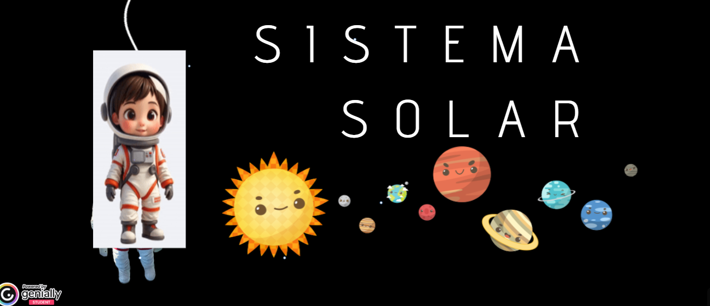

# EL SISTEMA SOLAR

En un mundo donde la ciencia avanza a pasos acelerados y el universo sigue siendo una fuente
inagotable de misterios, es fundamental que desde edades tempranas los estudiantes desarrollen
una relación cercana, crítica y creativa con el conocimiento científico. Por ello, se presenta la
propuesta curricular “Explorando el Sistema Solar jugando: Una Misión Intergaláctica de Aprendizaje”, diseñada para estudiantes de quinto grado de primaria bajo el enfoque del Aprendizaje
Basado en Juegos (ABJ). Esta secuencia transforma el aula en un laboratorio lúdico donde los
niños no solo aprenden sobre los planetas, los movimientos terrestres o la exploración espacial,
sino que también se convierten en protagonistas activos de su propio proceso de descubrimiento.
La misión se articula a través de una narrativa inmersiva que conecta el conocimiento astronómico con la identidad cultural local, promoviendo así un aprendizaje significativo, contextualizado y
emocionante.

