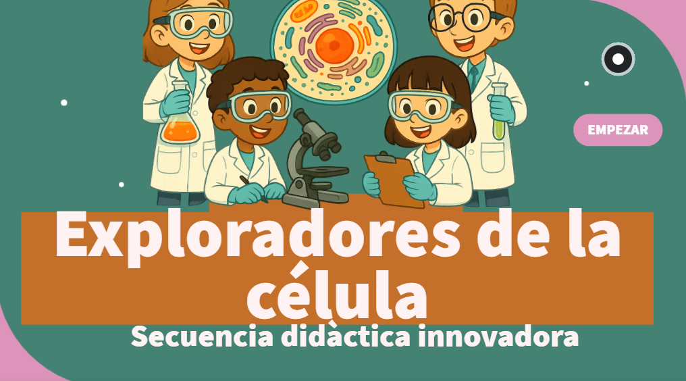

# Exploradores de la célula 
 Este genially esta orientada a estudiantes de primaria, centrada en la célula como unidad fundamental de los seres vivos. El contenido se
estructura en torno a cuatro ejes: el estudio de la célula, la identificación de sus organelos, la
clasificación entre células eucariotas y procariotas, y la diferenciación entre célula animal y
vegetal.
Esta secuencia tiene como objetivo central que los estudiantes comprendan la estructura y
función de la célula, reconociendo sus componentes y características principales. Asimismo, se
favorece el desarrollo de competencias digitales y cognitivas mediante el uso de recursos
multimedia (videos, infografías), herramientas interactivas (Genially, Educaplay) y actividades
gamificadas. Los criterios de evaluación se orientan hacia la comprensión de los contenidos, la
participación activa en las actividades digitales, la autonomía en el trabajo y la capacidad de
reflexión crítica sobre los aprendizajes alcanzados. 

Ven y exploremos juntos el mundo de la célula dando click a la siguiente imagen. 
