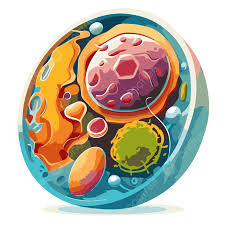

# 🌍 El Mundo Maravilloso de las Ciencias


## 📚 Descripción del repositorio
Este repositorio es una colección **educativa y didáctica** que reúne recursos multimedia, documentos PDF, notas en Markdown y guías interactivas para estudiantes de ciencias. Cada carpeta está organizada por temática y contiene:

- **Explicaciones teóricas** en archivos Markdown.
- **Presentaciones ilustradas** en PDF.
- **Videos y enlaces a Kahoot** para gamificar el aprendizaje.
- **Ejercicios y actividades** para reforzar conceptos.

## 📂 Estructura del contenido
| Carpeta | Descripción | Recursos principales |
|--------|-------------|----------------------|
| `El sistema solar` | Conceptos sobre nuestro sistema planetario. | `Sistemasolar.md`, imágenes de planetas. |
| `La_Celula` | Anatomía y función de la célula. | `presentacion.md`, `Exploradores_de_la_celula.md`, PDF ilustrado. |
| `la tierra y sus ecosistemas` | Ecología terrestre y redes tróficas. | `presentacion.md`, `pisos_termicos.md`, PDF de la red trófica, Kahoot. |
| `La_Celula/Video_de_la_celula.md` | Video introductorio de la célula. | Enlace a YouTube con miniatura. |

## 🔗 Metadatos y plataformas
- **Repositorio GitHub**: https://github.com/hmurillodeluque-max/El_mundo_maravilloso_de_las_ciencias
- **Formato de los archivos**: Markdown (`.md`), PDF, imágenes (`.png`, `.jpg`), videos embebidos (YouTube), quizzes interactivos (Kahoot).
- **Herramientas**: Visual Studio Code, Git, navegadores modernos para visualizar los videos y los quizzes.

## 👩‍🏫 Autores
| Nombre | Rol |
|--------|-----|
| **Gina Maritza Álvarez Torreglosa** | Estudiante de la especialización didáctica y TICS |
| **Juan Diego Flórez Vera** | Estudiante de la especialización didáctica y TICS |
| **Helga Cecilia Murillo Deluque** | Estudiante de la especialización didáctica y TICS |
| **Valeria Valera Morales** | Estudiante de la especialización didáctica y TICS |

## 📸 Imágenes ilustrativas
> Las imágenes se encuentran en la carpeta `assets/` y se usan en este README para mejorar la experiencia visual.



## 🚀 Cómo empezar
1. **Clona el repositorio**:
   ```bash
   git clone https://github.com/hmurillodeluque-max/El_mundo_maravilloso_de_las_ciencias.git
   cd El_mundo_maravilloso_de_las_ciencias
   ```
2. **Explora las carpetas** y abre los archivos `README.md` internos para cada tema.
3. **Sigue los enlaces** a los PDFs y a los quizzes Kahoot para reforzar el aprendizaje.